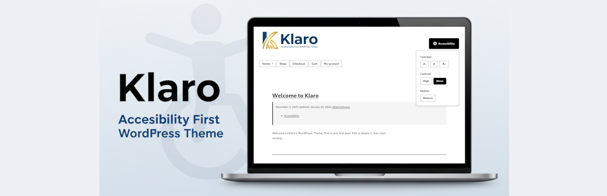

# Klaro WordPress Theme

**An uncompromisingly accessible WordPress Theme that prioritizes Accessibility First.**

[](https://wordpress.org/themes/klaro/)


---


## 🌟 Overview

Klaro is a WordPress theme built from the ground up with accessibility as the primary focus, not an afterthought. While most themes add accessibility features after design, Klaro starts with **WCAG AAA color contrast** and builds everything around that foundation.

**Now with full WooCommerce accessibility support** - build accessible online stores with WCAG AAA color contrast on shop pages, accessible cart and checkout, screen reader announcements, and 44px minimum touch targets.

Perfect for:
- Government and educational institutions
- Non-profit organizations
- Healthcare providers
- WordPress developers and Content creators with disabilities
- Any site committed to digital accessibility
- **Accessible e-commerce stores** with WooCommerce

**Available on WordPress.org:** [wordpress.org/themes/klaro](https://wordpress.org/themes/klaro/) · Current version **2.7.0** · Tested up to WordPress 7.0

---

## 🆕 What's New in 2.4 to 2.7

Four new visitor-facing accessibility features, one per release, all available from the front-end accessibility toolbar and remembered per visitor.

- 🌙 **Dark mode** (2.4.0), a softer dark color scheme alongside High Contrast and Monochrome, available as a toolbar toggle and as a site-wide Customizer contrast mode, with all color pairs meeting WCAG AAA
- 🎨 **Color vision filters** (2.5.0), assistive daltonization for protanopia (red-blindness), deuteranopia (green-blindness), and tritanopia (blue-blindness) that shifts imperceptible color information into a visible range instead of simulating the deficiency
- 🔤 **Dyslexia-friendly font** (2.6.0), switches body text and form controls to the bundled [OpenDyslexic](https://opendyslexic.org/) typeface (SIL Open Font License 1.1); the font files are only downloaded while the mode is active
- 📖 **Reading aids** (2.7.0), three independent toggles for increased text spacing (the WCAG 1.4.12 Text Spacing values), link highlighting that follows every color mode, and a large high-visibility cursor

Earlier, the 2.3.x releases updated Klaro to meet the [2026 WordPress.org accessibility-ready requirements](https://make.wordpress.org/themes/handbook/review/accessibility/required/), including landmark naming, focus contrast, button-controlled submenus, and an `accessibility.txt` statement in the theme root ([Trac #264262](https://themes.trac.wordpress.org/ticket/264262)).

---

## ✨ Key Features

### Visitor Accessibility Toolbar
A front-end toolbar on every page, with each visitor's choices remembered:
- ✅ **Text Size**: 5 levels, from 18px up to 32px
- ✅ **Color Modes**: High Contrast, Monochrome, and Dark mode
- ✅ **Color Vision Filters**: assistive daltonization for protanopia, deuteranopia, and tritanopia
- ✅ **Dyslexia-Friendly Font**: bundled OpenDyslexic typeface
- ✅ **Reading Aids**: increased text spacing, link highlighting, large cursor
- ✅ **Reduce Motion**: turns off animations and transitions

### Visual Accessibility
- ✅ **WCAG AAA Contrast Ratios** (7:1 minimum for all text)
- ✅ **Multiple Color Modes**: Standard AAA, High Contrast, Monochrome, Dark
- ✅ **User-Adjustable Text Sizes**: 18px base (up to 32px)
- ✅ **Generous Line Spacing**: 1.8 line height default
- ✅ **Optimal Line Length**: Maximum 70 characters for readability

### Keyboard & Motor Accessibility
- ✅ **Full Keyboard Navigation**: Every feature accessible via keyboard
- ✅ **Highly Visible Focus Indicators**: 3px thick, high-contrast outlines
- ✅ **Large Touch Targets**: Minimum 44x44px for all interactive elements
- ✅ **Comprehensive Skip Links**: Skip to navigation, main content, sidebar, and footer

### Screen Reader Optimization
- ✅ **Semantic HTML5 Structure**: Proper heading hierarchy throughout
- ✅ **Comprehensive ARIA Implementation**: Landmarks, labels, live regions
- ✅ **Meaningful Link Text**: No "click here" or generic links
- ✅ **Alt Text Enforcement**: Prevents publishing without image descriptions
- ✅ **Breadcrumb Navigation**: Schema.org structured data on all pages

### Cognitive & Motion Accessibility
- ✅ **Respects prefers-reduced-motion**: No unwanted animations
- ✅ **User Toggle for Animations**: Complete control over motion
- ✅ **Dyslexia-Friendly Font Toggle**: Bundled OpenDyslexic typeface
- ✅ **Reading Aids**: WCAG 1.4.12 text spacing, link highlighting, large cursor
- ✅ **No Autoplay**: All media requires user interaction
- ✅ **Clear Visual Hierarchy**: Consistent, logical layout

### WooCommerce Accessibility
- ✅ **Accessible Shop Pages**: ARIA landmarks, proper heading hierarchy
- ✅ **Accessible Cart & Checkout**: Table accessibility, form labels, error handling
- ✅ **Screen Reader Announcements**: ARIA live regions for cart updates
- ✅ **Keyboard Navigation**: Product tabs, gallery thumbnails, quantity controls
- ✅ **44px Touch Targets**: All buttons and interactive elements
- ✅ **Quantity +/- Buttons**: Accessible increment/decrement controls
- ✅ **High Contrast Support**: Full WooCommerce styling in all color modes
- ✅ **Skip Links**: Shop, products, cart, and checkout navigation

---

## 📦 Installation

### Via WordPress.org (Recommended)

Klaro is published on the [WordPress.org theme directory](https://wordpress.org/themes/klaro/). Install and receive automatic updates directly from your dashboard:

```
Appearance > Themes > Add New > Search "Klaro"
```

### Manual Installation

1. Download the theme ZIP from the [WordPress.org theme page](https://wordpress.org/themes/klaro/)
2. Go to **Appearance > Themes > Add New > Upload Theme**, choose the ZIP file, and click **Install Now**, or unzip and upload the `klaro` folder to `/wp-content/themes/`
3. Click **Activate**

---

## 🔌 Companion Plugin

The free [Klaro Admin Accessibility](https://wordpress.org/plugins/klaro-admin-accessibility/) plugin extends the same accessibility approach to the WordPress admin, with high contrast mode, large text, enhanced focus indicators, reduced motion, a simplified menu, and a classic editor toggle. The theme works fully without it.

---

## 🎨 Child Theme

To customize Klaro without losing your changes on updates, use a child theme. Create a folder in `/wp-content/themes/` with a `style.css` whose header sets `Template: klaro`, add a `functions.php` if needed, and activate it in **Appearance > Themes**. See the [WordPress child theme documentation](https://developer.wordpress.org/themes/advanced-topics/child-themes/) for details.

---

## 🛠️ Requirements

- **WordPress:** 6.0 or higher
- **PHP:** 7.4 or higher
- **Modern Browser**: Chrome, Firefox, Safari, Edge (last 2 versions)

---

## 📖 Documentation

- **[Changelog](CHANGELOG.md)** - Version history
- **[Accessibility statement](accessibility.txt)** - Features, testing methodology, and how to report accessibility issues
- **[readme.txt](readme.txt)** - WordPress.org readme with FAQ and bundled resource licenses

---

## 🎯 Accessibility Standards Met

- ✅ **WCAG 2.2 Level AA** conformance, with **AAA color contrast** (7:1) for all text
- ✅ **Section 508** compliance
- ✅ **ARIA 1.2** specifications
- ✅ **Keyboard navigation** (all features)
- ✅ **Screen reader compatibility** (NVDA, JAWS, VoiceOver, ORCA)

---

## 🤝 Contributing

Contributions are welcome! Please feel free to submit a Pull Request.

### Development Setup:

```bash
# Clone the repository
git clone https://github.com/rafael-minuesa/klaro.git

# Navigate to theme directory (the repository root is the theme)
cd klaro

# Symlink to WordPress themes directory (adjust path as needed)
ln -s $(pwd) /path/to/wordpress/wp-content/themes/klaro
```

### Reporting Issues:

Found a bug or accessibility issue? Please [open an issue](https://github.com/rafael-minuesa/klaro/issues) with:
- WordPress version
- Theme version
- Steps to reproduce
- Expected vs actual behavior
- Screenshots (if applicable)

---

## 📄 License

Klaro WordPress Theme, Copyright 2025 Rafael Minuesa

Klaro is distributed under the terms of the [GNU General Public License v2.0 or later](LICENSE).

This program is free software: you can redistribute it and/or modify it under the terms of the GNU General Public License as published by the Free Software Foundation, either version 2 of the License, or (at your option) any later version.

This program is distributed in the hope that it will be useful, but WITHOUT ANY WARRANTY; without even the implied warranty of MERCHANTABILITY or FITNESS FOR A PARTICULAR PURPOSE. See the GNU General Public License for more details.

---

## 🙏 Credits

- Built with accessibility in mind from day one
- Tested with NVDA, JAWS, VoiceOver, and ORCA screen readers
- Follows WordPress Coding Standards
- Inspired by the need for truly accessible web experiences

---

## 🔗 Links

- **WordPress.org:** https://wordpress.org/themes/klaro/
- **GitHub:** https://github.com/rafael-minuesa/klaro
- **Issues:** https://github.com/rafael-minuesa/klaro/issues
- **Author:** https://github.com/rafael-minuesa

---

**Made with ♿ for everyone**
